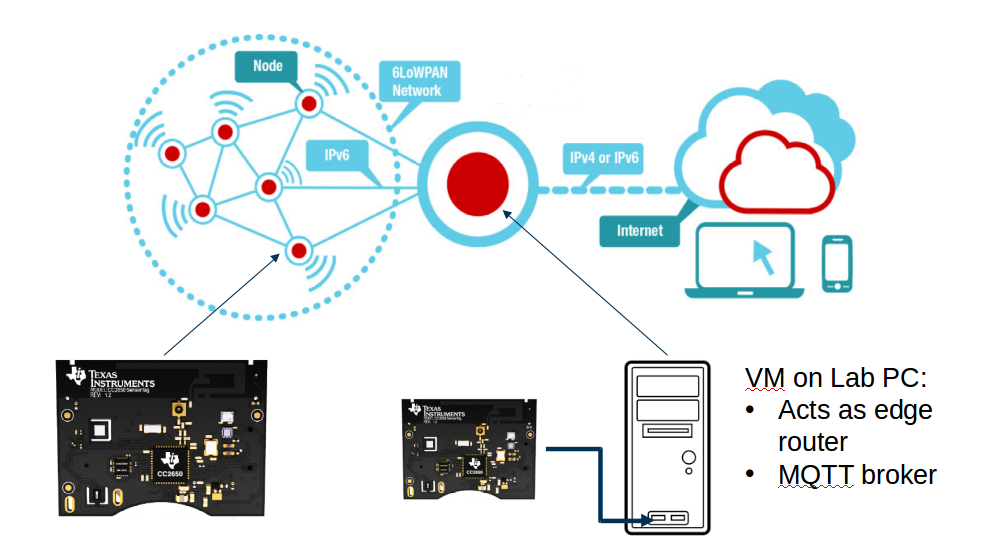
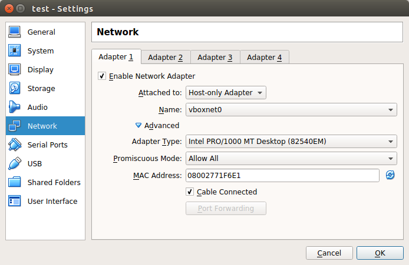
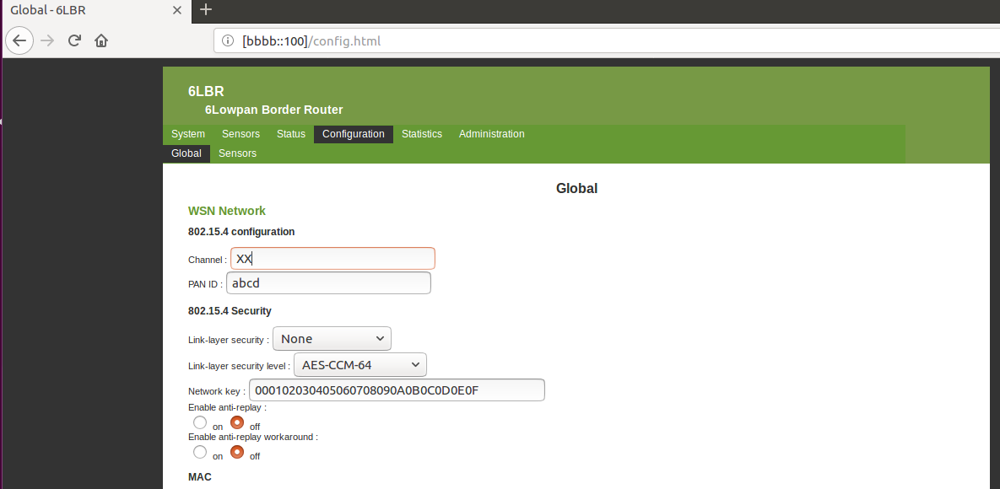
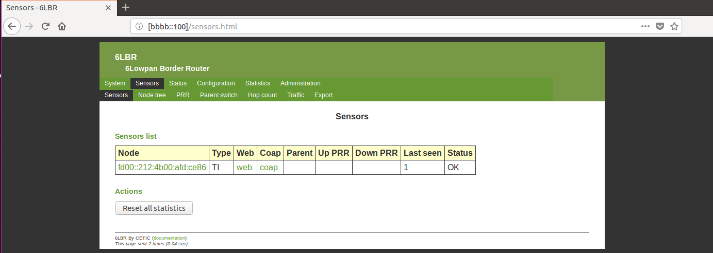
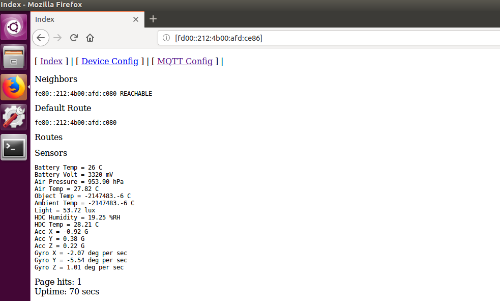

# LAB setup 

## Overview

## VM

The edge router [6lbr](https://github.com/cetic/6lbr/wiki) is running on a VM on the LAB PCs.

The VM is located at the following path `/IOT-LAB`  that is accessible by each student.

To run the virtual machine we are using `Oracle VM VirtualBox`.

### Setting up the virtual machine

New -> Create Virtual Machine:
- Name: <choose a name>
- Type: Linux
- Version: Ubuntu (64-Bit)
--> Next

Change the memory size to 2048 MB.  --> Next

Hard disk -> Use an existing virtual hard disk file -> Choose the VM in `/IOT-LAB`
--> Create

Change the Network Settings of the VM to the following settings:

### Usage of VM

For the edge router to work you have to attach a sensortag with debugger (use the debugger with the label _SLIP_) with the program `Slip-radio.elf` from Folder `/Binaries`.

If the router is booted up correctly you can reach the router interface with the browser under `bbbb::100`

Here you can do the following things:

#### 1. Change settings for the 6LoWPAN network

Here you only have to change the channel number according to the correct channel for your group. You can see the correct channel on the central `README.md` in your repository.

#### 2. See conntected Sensortags

You can show an overview of connected sensortags at "Sensors":

If you click on `web` you will get to an website that shows the current values of the sensors:

