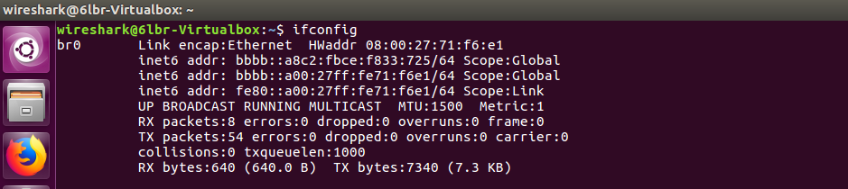

# MQTT-Broker

This file explains the MQTT Broker used in this lab. The broker that we will be using is called [mosquitto](https://mosquitto.org/).

The broker is already installed on the VM of the IOT-Lab PC in the room [N1003](https://portal.mytum.de/campus/roomfinder/roomfinder_viewmap?mapid=67&roomid=N1003%20ZG@0101). The authentication credentials are unique for each lab pc, please look at [room plan](img/roomplan.png) for the corresponding PCs for your group. 

The documentation for the moquitto broker can be found [here](https://mosquitto.org/man/mosquitto-8.html).

The broker comes with two client programs that can publish and subscribe to certain topics on the running mosquitto broker. The clients are installed on all the lab PCs. 
Since the broker is running on the VM you have to specify the ip adress of the host.
Use the one starting with _bbbb::_ on the interface br0 (can be found with `ifconfig`) that has the same address as _fe80::_. See the following picture:



## Publish

The `mosquitto_pub` client can be used to publish to a topic on the broker.

```bash
mosquitto_pub -h <broker ip> -u <username> -P <password> -t <topicname> -m <message as String>
```

## Subscribe

The `mosquitto_sub` client can be used to subscribe to certain topics.

```bash
mosquitto_sub -h <broker ip> -u <username> -P <password> -t '#'
```

With `-t` you can specify the topic that you want to subscribe. The string '#' can be used to receive all messages.

## Optional: Installation of mosquitto on your local machine

```bash
sudo apt-get install mosquitto mosquitto-clients
```
Other usefull commands for the installed mosquitto:

```
# Can only be executed as root
systemctl status mosquitto.service # Check if mosquitto is running
systemctl stop mosquitto.service # Halt the service
systemctl start mosquitto.service # Start the service
systemctl restart mosquitto.service # Restart the service
```